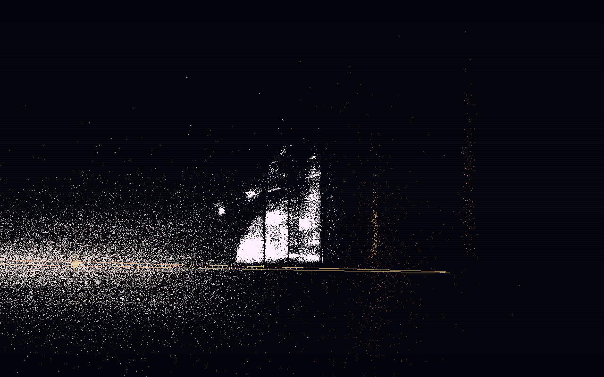

# Asteroid Belt Visualization

A real-time 3D asteroid belt simulation rendered with **Pygame**, using up to 100 000 asteroids from the [Lowell Observatory astorb catalogue](https://asteroid.lowell.edu/main/astorb/) and proper orbital elements from the AstDyS table2 dataset.



---

## Features

- **Up to 100 000 asteroids** with real osculating and proper orbital elements (a, e, i, ω, Ω, M₀)
- **Progressive activation** — asteroids start orbiting one by one, ordered by their mean anomaly M₀, so you watch the belt assemble from nothing
- **Motion trails** — a fading glow follows each asteroid as it starts moving
- **Family colour coding**
  - White/grey — Main belt
  - Amber — Hildas (3:2 MMR with Jupiter, a ≈ 3.7–4.2 AU)
  - Brick-red — Jupiter Trojans (a ≈ 4.8–5.5 AU)
  - Cyan-green — Near-Earth Objects (q ≤ 1.3 AU)
- **Depth shading** — asteroids behind the ecliptic plane are rendered dimmer
- **Full 3D camera** — azimuth, elevation, roll, zoom, and vertical/horizontal pan
- **Camera animation timeline** — keyframe-based cinematic flythrough (toggle with K)
- **a/i plane view** — waiting asteroids displayed in orbital parameter space (semi-major axis vs. max orbital height); toggle with I
- **Planet reference orbits** — Earth, Mars, Jupiter

---

## Data

| File | Description |
|------|-------------|
| `data/astorb.dat.gz` | Lowell Observatory osculating elements (~1.3 M asteroids) |
| `data/table2.dat.gz` | AstDyS proper elements (~600 K asteroids) |

Download links and format descriptions are in [data/ReadMe](data/ReadMe).

---

## Requirements

```
numpy
pygame
```

Install with:

```bash
pip install -r requirements.txt
```

---

## Running

```bash
python3 main.py
```

Optional arguments:

```bash
python3 main.py [table2.dat.gz] [astorb.dat.gz]
```

---

## Controls

| Key / Input | Action |
|-------------|--------|
| `SPACE` | Pause / resume |
| `F` | Reverse time direction |
| `+` / `-` | Increase / decrease activation speed |
| `Arrow keys` | Pan view |
| `A` / `D` | Rotate azimuth |
| `W` / `S` | Tilt elevation |
| `Z` / `X` | Roll ecliptic |
| `Scroll wheel` | Zoom in / out |
| `I` | Toggle waiting asteroids: a/i plane ↔ real orbital positions |
| `O` | Toggle planet orbit lines |
| `H` | Toggle HUD |
| `K` | Toggle camera animation |
| `R` | Reset simulation |
| `Q` / `Esc` | Quit |

---

## How it works

1. **Orbit solving** — Kepler's equation is solved with Newton-Raphson (6 iterations) for all asteroids in a single vectorised NumPy pass.
2. **Activation** — each asteroid has a catalogue mean anomaly M₀ ∈ [0°, 360°). The simulation clock advances in degrees/second; an asteroid starts orbiting when `sim_time ≥ M₀`.
3. **Starting position** — every asteroid begins its orbit at the y = 0 ecliptic crossing (the point where it passes through the viewer's screen plane) to minimise the visual jump from the waiting position.
4. **Waiting display** — unactivated asteroids are shown at (a, a·sin i) in AU, forming the classical a/i distribution plot that reveals the Kirkwood gaps and resonance families.
5. **Rendering** — asteroid positions are written directly into a `surfarray` pixel buffer for maximum throughput at 60 FPS with 100 k bodies.
